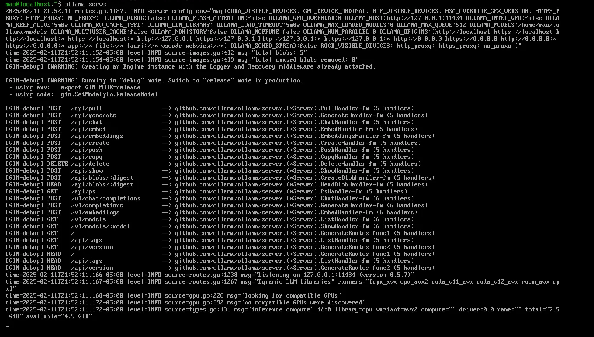
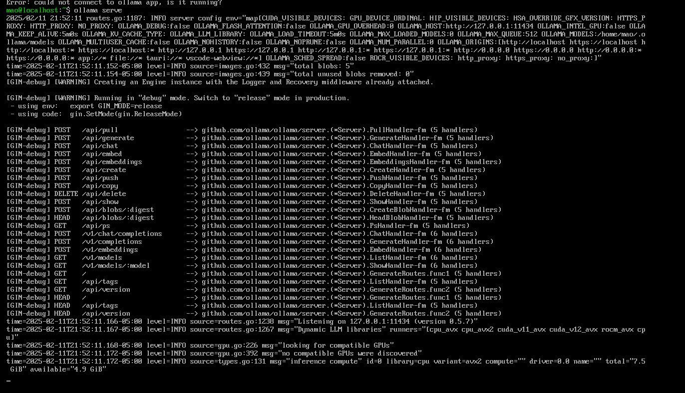

# 本地离线部署deepseek

参考文档

[https://github.com/ollama/ollama/blob/main/docs/faq.md](https://github.com/ollama/ollama/blob/main/docs/faq.md)

[https://github.com/ollama/ollama/blob/main/docs/modelfile.md](https://github.com/ollama/ollama/blob/main/docs/modelfile.md)

[https://github.com/ollama/ollama/blob/main/docs/linux.md](https://github.com/ollama/ollama/blob/main/docs/linux.md)

## 第一步：准备所需要的资源

1. 下载文件，作者在后续的步骤中将它们放在了deepseeksetup的文件夹下面:
    
    [ollama-linux-amd64.tgz](https://github.com/ollama/ollama/releases) 下载文件名对应文件
    
    gguf模型   [deepseek from huggingface](https://huggingface.co/collections/unsloth/deepseek-r1-all-versions-678e1c48f5d2fce87892ace5)
    
    Modelfile.txt 
    
    [Modelfile.txt](Modelfile.txt)
    
2. 登录服务器
3. 将deepseeksetup文件夹转移到服务器上

## 第二步：安装ollama

1. cd 到deepseeksetup文件夹的路径下

```bash
cd /path/to/deepseeksetup
```

1. 运行命令安装ollama

```bash
sudo tar -C /usr -xzf ollama-linux-amd64.tgz
```

3.启动ollama服务

```bash
ollama serve
```

应该会得到这样的窗口



4.保持刚刚运行ollama的服务窗口，新建虚拟命令窗口确认ollama服务运行

```bash
ollama -v
```



出现版本号说明ollama安装成功

## 第三步：创建模型

1. 更改Modelfile.txt中的参数（参数详细解析可见[官方文档](https://github.com/ollama/ollama/blob/main/docs/modelfile.md)，此处只解释安装deepseek时需要修改的参数）
    
    FROM： 指向你存放的.gguf文件的路径
    

```bash
FROM /Path/to/DeepSeek-R1-Distill-Qwen-1.5B-Q8_0.gguf
```

下面给出的模版仅适用于deepseekr1

Modelfile.txt  模板

```bash
FROM /path/to/DeepSeek-R1-Distill-Qwen-1.5B-Q8_0.gguf

TEMPLATE """{{- if .System }}{{ .System }}{{ end }}

{{- range $i, $_ := .Messages }}

{{- $last := eq (len (slice $.Messages $i)) 1}}

{{- if eq .Role "user" }}<｜User｜>{{ .Content }}

{{- else if eq .Role "assistant" }}<｜Assistant｜>{{ .Content }}{{- if not $last }}<｜end▁of▁sentence｜>{{- end }}

{{- end }}

{{- if and $last (ne .Role "assistant") }}<｜Assistant｜>{{- end }}

{{- end }}"""

PARAMETER stop <｜begin▁of▁sentence｜>

PARAMETER stop <｜end▁of▁sentence｜>

PARAMETER stop <｜User｜>

PARAMETER stop <｜Assistant｜>

LICENSE """MIT License

Copyright (c) 2023 DeepSeek

Permission is hereby granted, free of charge, to any person obtaining a copy

of this software and associated documentation files (the "Software"), to deal

in the Software without restriction, including without limitation the rights

to use, copy, modify, merge, publish, distribute, sublicense, and/or sell

copies of the Software, and to permit persons to whom the Software is

furnished to do so, subject to the following conditions:

The above copyright notice and this permission notice shall be included in all

copies or substantial portions of the Software.

THE SOFTWARE IS PROVIDED "AS IS", WITHOUT WARRANTY OF ANY KIND, EXPRESS OR

IMPLIED, INCLUDING BUT NOT LIMITED TO THE WARRANTIES OF MERCHANTABILITY,

FITNESS FOR A PARTICULAR PURPOSE AND NONINFRINGEMENT. IN NO EVENT SHALL THE

AUTHORS OR COPYRIGHT HOLDERS BE LIABLE FOR ANY CLAIM, DAMAGES OR OTHER

LIABILITY, WHETHER IN AN ACTION OF CONTRACT, TORT OR OTHERWISE, ARISING FROM,

OUT OF OR IN CONNECTION WITH THE SOFTWARE OR THE USE OR OTHER DEALINGS IN THE

SOFTWARE.

"""
```

如要部署别的模型请根据[https://ollama.com/library/deepseek-r1](https://ollama.com/library/deepseek-r1) 中的相关参数进行更改


1. 构建模型

```bash
#ollama create choose-a-model-name -f <location of the file e.g. ./Modelfile> 

ollama create deepseek-r1:1.5b -f /path/to/Modelfile.txt
```

1. 确认ollama模型导入情况

```bash
ollama list
```


出现模型名字即为成功

## 第四步：运行模型

```bash
#model name 见ollama list中的显示 示例为deepseek-r1:1.5b
ollama run deepseek-r1:1.5b
```

## 网络API相关（还没成功，有待后续实现）

参考[官方文档1](https://github.com/ollama/ollama/blob/main/docs/linux.md#adding-ollama-as-a-startup-service-recommended)，[官方文档2](https://github.com/ollama/ollama/blob/main/docs/faq.md#setting-environment-variables-on-linux)

**添加 Ollama 作为初创服务（推荐）**

创建 Ollama 的用户和组：

```
sudo useradd -r -s /bin/false -U -m -d /usr/share/ollama ollama
sudo usermod -a -G ollama mao
```

创建一个服务文件在 `/etc/systemd/system/ollama.service` :

```
[Unit]
Description=Ollama Service
After=network-online.target

[Service]
ExecStart=/usr/bin/ollama serve
User=ollama
Group=ollama
Restart=always
RestartSec=3
Environment="PATH=$PATH"[Install]
WantedBy=default.target
```

然后启动服务：

`sudo systemctl daemon-reload
sudo systemctl enable ollama`
